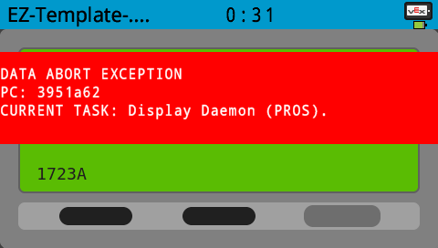

## Why is my robot so slow?

Try tuning [odom_look_ahead value](https://ez-robotics.github.io/EZ-Template/docs/odom_general#odom_look_ahead_set), 10 is a good start.

## Is there a minimum speed for drive motions?

No, there is no minimum speed for drive motions. If you are having issues with your robot not reaching its target, tune the PID following [this guide](https://ez-robotics.github.io/EZ-Template/tutorials/tuning_pid_constants).

## Why is my auton not working / controller buzzing three times / Red loading bar

This indicates an IMU issue. Check your cable / port to make sure its wired correctly.  

## Why does my robot keep spinning in place?

Most likely your left and right drivetrain ports are flipped. Inverse them by adding/removing negative sign.
You can follow this tutorial on configuring the [Drive Constructor](https://ez-robotics.github.io/EZ-Template/tutorials/installation#configure-the-drive-constructor).

## How do I account for IMU drift?

You can try to mediate slight IMU drift by tuning the [IMU Scaler](https://ez-robotics.github.io/EZ-Template/tutorials/tuning_imu_scale).

## Why is my program encountering "DATA ABORT EXCEPTION"

This ooccurs most often due to either an issue with a improperly formatted SD, or a repeating user task with no delay. Follow [this guide](https://ez-robotics.github.io/EZ-Template/tutorials/using_ez#micro-sd-card-support) for formatting your micro-sd card.

