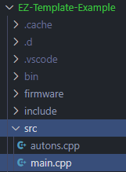
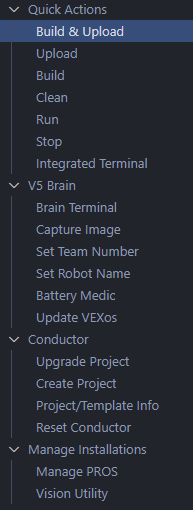

:::note

All versions of EZ-Template require you to use an [IMU](https://www.vexrobotics.com/276-4855.html).  You can find mounting instructions [here](https://kb.vex.com/hc/en-us/articles/360037382272-Using-the-V5-Inertial-Sensor).  

:::

## Download PROS
PROS is an open-source project developed by students at Purdue that gives us functions to interact with our V5 brain and other devices that connect to it.  If you don't have it installed, you can read their [Getting Started page here](https://pros.cs.purdue.edu/v5/getting-started/index.html).

## Download EZ-Template
Download the latest `EZ-Template-Example-Project.zip` by [clicking here](https://github.com/EZ-Robotics/EZ-Template/releases/latest/download/EZ-Template-Example-Project.zip) and extract the zip file.  [Click here](https://www.filecenter.com/blog/how-to-unzip-files-mac-iphone-android-windows/) if you're unsure how to extract a zip file.  

## Open EZ-Template-Example-Project
Add the folder to your workspace.  You can do this by going to the very top of your screen and selecting `File` -> `Add Folder to Workspace`.  This will bring up a window and you'll have to navigate to where you extracted the example project.  If you're unsure where you extracted it, it's most likely in your `Downloads` folder.  

## Open `main.cpp`
You'll find `main.cpp` by selecting `EZ-Template-Example-Project` and opening `src`.  `main.cpp` is your main file where you can modify your user control code, the root of your autonomous routines, etc.  


## Configure the Drive Constructor
Near the top of `main.cpp` you'll see some code that looks like this.  This is your drive constructor, and it gives EZ-Template your chassis motor ports, the IMU port, the size of your wheels, and the rpm your wheels go at.  All of this information is needed so EZ-Template can make sure your robot is going the correct distances.  Configure these numbers to your robot.  

To figure out which motors are reversed and not reversed, open the devices menu on your brain.  This is on your home screen.  Select any motor and hold down the right button.  Keep note if that motor is going forward or backwards, and if it's the left or right side.  Repeat this for all of your drivetrain motors.  

Input all of your left motors into the constructor first.  If you have more/less motors, you can add/remove numbers from the curly braces.  If any of the motors put the robot backwards, make that port negative.  Repeat for the right side.  
```cpp
// Chassis constructor
ez::Drive chassis(
    // These are your drive motors, the first motor is used for sensing!
    {1, 2, 3},     // Left Chassis Ports (negative port will reverse it!)
    {-4, -5, -6},  // Right Chassis Ports (negative port will reverse it!)

    7,       // IMU Port
    4.125,   // Wheel Diameter (Remember, 4" wheels without screw holes are actually 4.125!)
    343.0);  // Wheel RPM = cartridge * (motor gear / wheel gear)
```

## Configure Tracking Wheels
Are you using tracking wheels?  You can configure them here!

The examples below show you how to create tracking wheels using ADI Encoders, ADI Encoders plugged into 3-wire Expanders, and Rotation Sensors.  

`2.75`  is the wheel diameter, and `4.0` is the distance to the center of the robot.  You can use a tape measure to find this value.  
```cpp
ez::tracking_wheel right_tracker({-'A', -'B'}, 2.75, 4.0);  // ADI Encoders
ez::tracking_wheel left_tracker(1, {'C', 'D'}, 2.75, 4.0);  // ADI Encoders plugged into a Smart port
ez::tracking_wheel horiz_tracker(1, 2.75, 4.0);             // Rotation sensors
```

You'll now need to tell EZ-Template what tracking wheels to use.  
```cpp
void initialize() {
  // Print our branding over your terminal :D
  ez::ez_template_print();

  pros::delay(500);  // Stop the user from doing anything while legacy ports configure

  // Are you using tracking wheels?  Comment out which ones you're using here!
  chassis.odom_tracker_right_set(&right_tracker);
  chassis.odom_tracker_left_set(&left_tracker);
  chassis.odom_tracker_back_set(&horiz_tracker);  // Replace `back` to `front` if your tracker is in the front!

  // . . .
}
```

## Build and Upload 
:::warning

If you see a white dot at the top of your file name, this means your code is not saved!  Please save your code with `ctrl + s` on Windows or `command + s` on Mac. 

:::
First, take a micro-USB cable and connect it between your computer and the robot.  You may also connect it to the controller, but only if your controller is already linked to the robot.  If you're unsure if your controller is paired or not, [read this article](https://kb.vex.com/hc/en-us/articles/360035592532-Pairing-the-V5-Controller-with-the-V5-Brain-for-a-Wireless-Connection).  

At the left of your screen, select this icon.   


Select `Build and Upload`.  Building your code makes sure you have no errors and sets everything up to upload your code to the robot.  Once this is complete, it will upload code to your robot.   


## Making Sure the IMU is Detected
Run the program on the brain.  You should see a loading bar come up on the brain.  If this bar goes completely red, you have a problem with your IMU.  You've either used the wrong port in your drive constructor, you have a bad cable, or you have a bad IMU.  You'll have to debug this to find out which one is bad.  

## Making Sure Drive Ports are Correct
The default drive mode for EZ-Template is tank drive, where the left stick controls the left side of the drive and the right stick controls the right side of the drive.  If all of the ports are set up correctly, the robot will drive!  

If the motors sound like they're running but they get locked up, you have a motor going in the wrong direction.  I suggest unplugging motors until you find the 1 going the wrong way, find out which port is going the wrong way, and update your drive constructor accordingly.  

## Making Sure Tracking Wheels are Reversed Correctly
Once you start up your code, go left on the autonomous selector once.  This will bring you to a blank page that ships with the example project.  

Ensure that your left/right tracking wheels increase positively when pushing the robot forward, and your front/back tracking wheels increase positively when pushing the robot to the right.  

If any sensor is reading the wrong way, make the port negative in the constructor.  

## You're Setup!
🥳🥳You're all set up!  The next page will show you how to run the built-in example autonomous routines.  

