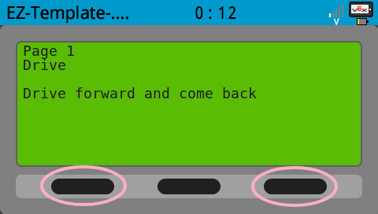

import Tabs from '@theme/Tabs';
import TabItem from '@theme/TabItem';

A quick run through of how to use EZ-Template and things to keep in mind.  

## IMU Calibration
When you turn your program on, a loading bar will appear on the brain screen.  This is your Inertial Measurement Unit (IMU) calibrating.  The IMU need some time to calibrate, and during this time **you cannot move the robot.**  For the calibration to be successful the robot cannot move during this time.  

The calibration is successful if the red loading bar does not appear.  As of the v3.2.0 example project, the controller will vibrate once quickly if the calibration was successful.  The controller will vibrate three long times if it was not successful or failed silently.  

The IMU is necessary for all EZ-Template motions, it is very important that this is done correctly.  

Once the IMU is calibrated, you're free to move the robot however you want.  At the start of autonomous the IMU gets reset to equal 0 so any drift that happens before that will be fixed.  

## Using the Autonomous Selector

### Why?
There are two main ways to have multiple autonomous routines: 
1. One program loaded with multiple routines.
2. Multiple programs with one routine each.

I dislike 2.  If you make a change to a PID constant or make a change to user control code, you now have to redownload multiple times.  I find this tedious and easy to make a mistake while under pressure at a tournament.  

### Selecting the Autonomous Routine
The brain screen has 3 buttons.  With EZ-Template the center button does nothing.  You can navigate through the menus by selecting the left or right button.  Once autonomous mode is enabled, the page that is left open will be the autonomous routine that runs.  

  

### Testing With a Competition Switch
With a competition switch, run your code in disable.  Select the autonomous on the screen.  Change the competition switch to `Autonomous` on your competition switch, and set it to `Enable`.  Your autonomous routine will run!

### Testing Without a Competition Switch
This code changed in the example project slightly between 3.0.x and 3.1.0, where it now requires multiple buttons to be held to prevent accidental triggers.  But, holding `B` and `DOWN` will run the selected autonomous routine during driver control.  
<Tabs
  groupId="310"
  defaultValue="proto"
  values={[
    { label: '>3.1.0',  value: 'proto', },
 { label: '<3.1.0',  value: 'example', },
  ]
}>

<TabItem value="example">

```cpp
// Trigger the selected autonomous routine
if (master.get_digital_new_press(DIGITAL_B))
  autonomous();
```
</TabItem>


<TabItem value="proto">

```cpp
// Trigger the selected autonomous routine
if (master.get_digital(DIGITAL_B) && master.get_digital(DIGITAL_DOWN))
  autonomous();
```
</TabItem>
</Tabs>

### Micro-SD Card Support
To make things easier at tournaments, having an SD card in your brain will save the last page between cycles.  So if you select page 3 then turn off the brain, the next time you turn the brain on it'll start from page 3.  This means you can select your autonomous routine while queueing for a match and it'll hold when you get to a match.  

The micro-SD card must be formatted to FAT32.  [Here](https://www.lifewire.com/format-sd-card-to-fat32-6666166) is a tutorial on how to do that. 


## Adding Autonomous Routines

### Make the Autonomous Routines
Make a new function in `src/autons.cpp` and name it something that quickly explains what the autonomous will do.  
```cpp
void SoloAWP() {
  // . . .
  // Autonomous code goes here
  // . . .
}

void ScoreRingsPlatDown() {
  // . . .
  // Autonomous code goes here
  // . . .
}

void NeutralStealPlatDown() {
  // . . .
  // Autonomous code goes here
  // . . .
}

void NeutralStealPlatUp() {
  // . . .
  // Autonomous code goes here
  // . . .
}
```

### Add it to `autons.hpp` 
In `include/autons.hpp` add the name of your function.  If this isn't done, `main.cpp` won't know what any of these names mean.  
```cpp
#pragma once

void SoloAWP();
void ScoreRingsPlatDown();
void NeutralStealPlatDown();
void NeutralStealPlatUp();
```

### Add it to the Autonomous Selector
To add the autonomous mode to the on-screen selector, in `src/main.cpp` go to `void initialize()` and either replace an existing autonomous mode or add new pages.
```cpp
void initialize() {
 // . . . 

  // Autonomous Selector using LLEMMU
  ez::as::auton_selector.autons_add({
    {"Solo AWP\n\nStarting Position: Plat Down", SoloAWP},
    {"Score Rings on Amogo\n\nStarting Position: Plat Down", ScoreRingsPlatDown},
    {"Neutral Steal\n\nStarting Position: Plat Down", NeutralStealPlatDown},
    {"Neutral Steal\n\nStarting Position: Plat Up", NeutralStealPlatUp},
 });

 // . . .
}
```