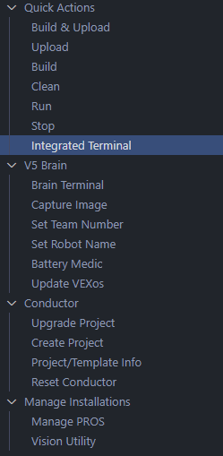

:::note

Most robots will work perfectly fine without tuning your wheel diameter.  You can visit this page if you start to see the undesired behavior described below.  

:::

## What is it?
Tuning wheel diameter will change how far the robot goes when you input 1".  The larger this number is, the less 1" will be.  This can be useful in making very precise autonomous routines easier to get working first try by guaranteeing 1" is truly 1".   

This is not required for consistent autonomous routines, it only makes the correlation between what the robot thinks it's doing and what it's actually doing match more closely.  

## Tuning 
We'll print our drive sensors to the terminal, so these tests will have to be done while plugged into either the controller or the robot.  The line of code below will go in the while loop in opcontrol.  
```cpp
printf("Left: %.2f   Right: %.2f\n", chassis.drive_sensor_left(), chassis.drive_sensor_right());
```

To open the pros terminal, we'll first select the pros icon on the left.  


Then we'll select `Integrated Terminal`.  This will bring up a menu at the bottom of VS Code, and it will populate when you're plugged into the robot or controller while it's running.  


Place your robot carefully, ideally against a wall to ensure consistency.  Now we'll push the robot a known distance.  Some number will be in our terminal now, probably close to the known distance but not quite exact.  Keep track of what these numbers are and this test can be repeated a couple of times.  That'll leave us with this:
```
Left: 24.29   Right: 24.22
Left: 24.38   Right: 24.40
Left: 24.20   Right: 24.18
```

All of these numbers are close showing that I was consistently pushing the robot the known distance.  Averaging all of these numbers gives us `x`.  Using the equation below we can find our new wheel size.  
```
(known distance / averaged sensor values) * previous wheel size
```

For the example data above, the average sensor value is 24.2783.  The robot was pushed 24", and the robot currently thinks it's using 2.75" wheels.  
```
(24 / 24.2783) * 2.75
```

## You're Done!
Take this new number and replace it with your wheel size in your drive constructor.  That's it!  